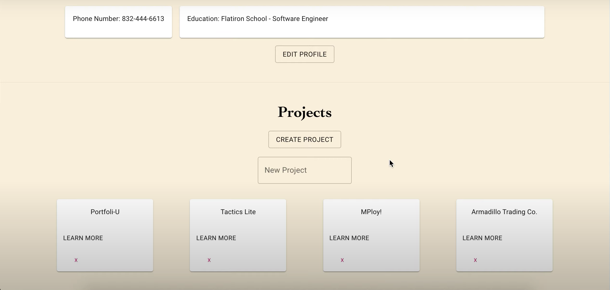

# Portfoli-U

Portfoli-U is a social project management app that allows users to connect through means of projects, all while keeping them organized.

The inspiration behind the app was entering a new job field and getting ready to connect with others in tech. Being able to show them projects I have worked on, while at the same time showing them how I kept organized throughout the process, was the goal in mind.

# Demo

👉 Watch it <a href='https://www.youtube.com/watch?v=DumBp8l2R6A'>here!</a>



# Prerequisites

Before you begin, ensure that you have met the follow requirements:

- You have installed the latest version of npm

```
    $ npm install
```

- You are using Mac/Windows/Linux

# Starting the App

```
    $ npm start
```

# Features

- User Profile Showcased
- Project Highlight
- Connection through Contributions

# Built With

- Ruby on Rails
- JavaScript w/ React

# Contributing to Portfoli-U

To contribute to Portfoli-U, follow these steps:

    1. Fork this repository.
    2. Create a branch: git checkout -b <branch_name>.
    3. Make your changes and commit them: git commit -m "<commit_message>"
    4. Push to the original branch: git push origin <project_name>/<location>
    5. Create the pull request.

# Contributers

Thanks to the follow who have contributed to this project:

    - @Tneebs 💻

# Contact

If you would like to contact me you can reach me at tedneben@gmail.com